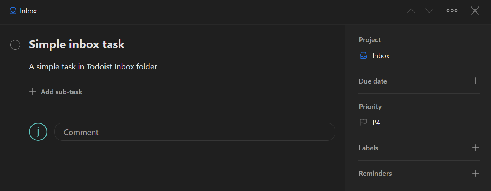

# Simple template

## Simple Inbox task

A template is `.yaml` or `.yml` file with some YAML syntax in it.
Todoist Project - Section structure is render with whitespace indentation.

Let's start with a simple example that is worth a thousand words:

```yaml
# simple_template_0.yml
Inbox:
  tasks:
    - content: "Simple inbox task"
      description: "A simple task in Todoist Inbox folder"
```

Now run `todoist-template.py` from you python virtual environment:

```shell
$ python todoist-template.py simple_template_0.yml
[INFO] Project: Inbox (2276740970)
[INFO] Task: Simple inbox task (6039034421)
```

This template will create *"Simple inbox task"* task in the Todoist Inbox without due date and default priority.


## Three simple tasks

Similarly you can create tasks in existing projects and sessions. For example, suppose you have in your Todoist the project *"Personal"* which is composed of the sessions *"Fitness"* and *"Diet"*. Now we want to add a new workout for the week.

Let's first create the template:

```yaml
# simple_template_1.yml
Personal:
  Fitness:
    tasks:
      -
        content: Tabata
        due_string: Monday
      -
        content: Resistance
        due_string: Wednesday
      -
        content: Treadmill
        due_string: fri
```

## JSON Simple task

Along YAML todoist-template support JSON template files:

```json
// simple_template_2.json
{
    "Inbox": {
        "tasks": [
            {
                "content": "Simple inbox task",
                "description": "A simple task in Todoist Inbox folder",
                "priority": 3
            }
        ]
    }
}
```

For more information on how to define a task read [Task](./template_yaml_syntax.md#task)

Next [Parameterized template](./param_template.md)